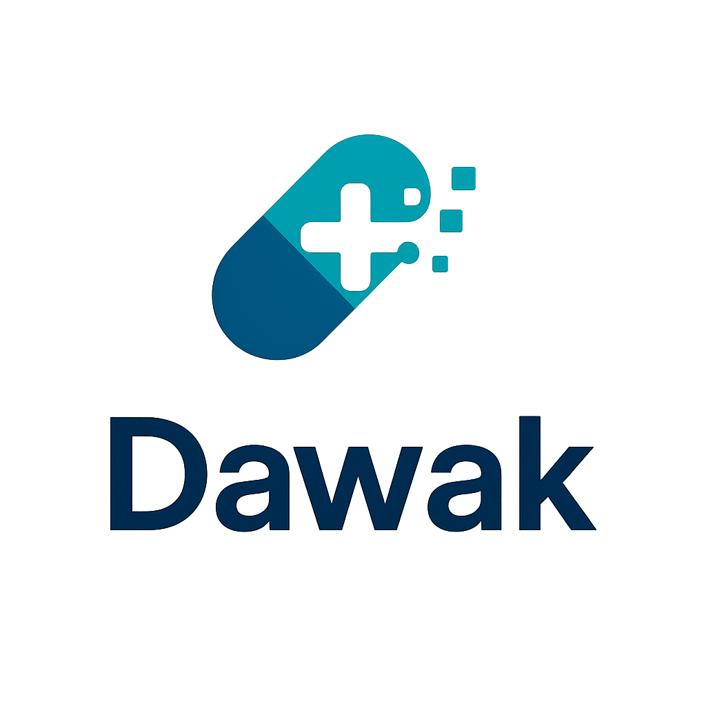

# 💊 Dawak – AI-Powered Medication Assistant

  

## 📖 Project Overview

Dawak is an innovative mobile application designed to improve medication safety and adherence in Egypt and the Arab world. Our solution addresses the critical problem of self-medication by providing an intuitive, AI-powered platform that helps users identify medications, avoid dangerous interactions, and manage their treatment schedules effectively.

## ✨ Key Features

- **Visual Medication Recognition**: Simply take a photo of any medication package to instantly identify it
- **Drug Interaction Warnings**: Get immediate alerts about potentially dangerous combinations
- **Smart Reminders**: Receive personalized dosage reminders based on your medications
- **Arabic-First Interface**: Fully designed and developed for Arabic speakers
- **Family Mode**: Caregivers can manage medications for family members

## 🛠️ Technical Approach

- **Frontend**: Cross-platform mobile application built with Flutter
- **Backend**: Cloud-based infrastructure using Firebase services
- **AI/ML**: Advanced OCR technology supporting Arabic and English text recognition
- **Design**: User-friendly interface with special attention to Arabic UX principles

## 👥 Our Team – SPARK @ IEEE Victoris 4.0

We are a dedicated team of developers, designers, and AI specialists participating in IEEE Victoris 4.0 competition:

| Role | Team Members |
|------|-------------|
| **AI/ML Engineering** | Hassan Abdel-razeq, Mohamed Mahmoud |
| **Backend Development** | Abdelrahman Ataa, Mohamed Hesham |
| **Mobile Development** | Kareem Mahfouz, Abdelrahman Mansour |
| **UX/UI Design** | Hend Adel, Mariam Elmetwally |

## 🌍 Vision

Our mission is to transform medication safety in Egypt and the broader Arab region through accessible technology that bridges the gap between healthcare professionals and patients.

---

  
  
  **Innovating for better healthcare in the Arab world**
  
  

